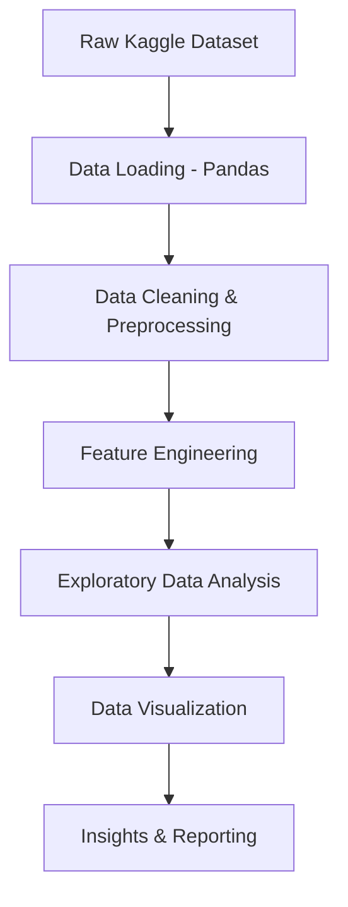
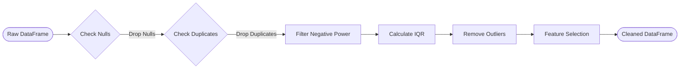
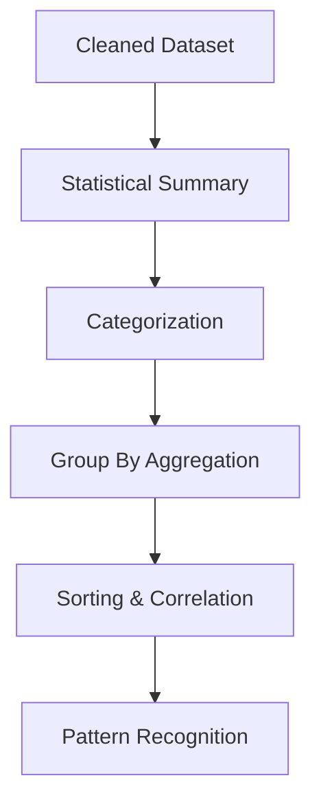
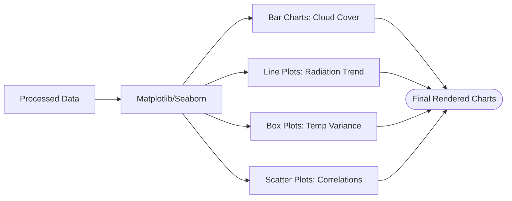

# Methodology & Architecture

This document outlines the high-level architecture and methodological workflow adopted for the Solar Power Generation Analysis project.

## 1. Project Workflow

The overall workflow from raw data ingestion to visualization.

## 2. Data Cleaning Pipeline

The systematic approach used to ensure data quality and integrity before analysis.

## 3. Data Analysis Workflow

The steps taken to extract analytical value from the processed data.

## 4. Visualization Pipeline

The process of translating analytical structures into visual insights.

